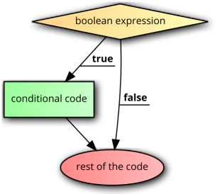
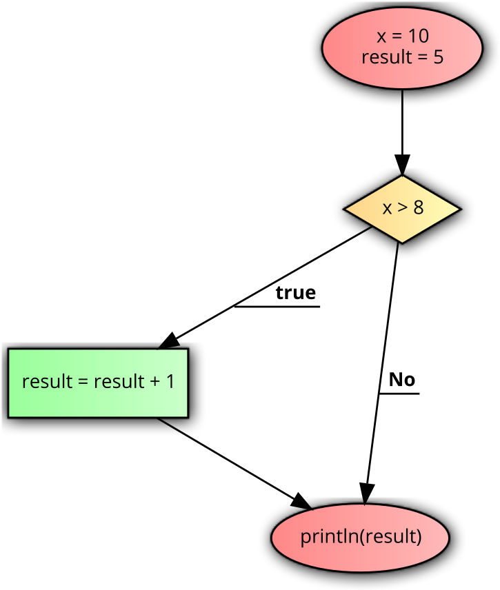
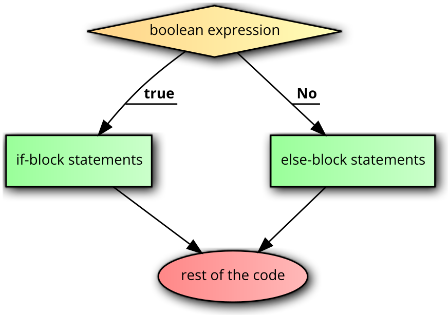
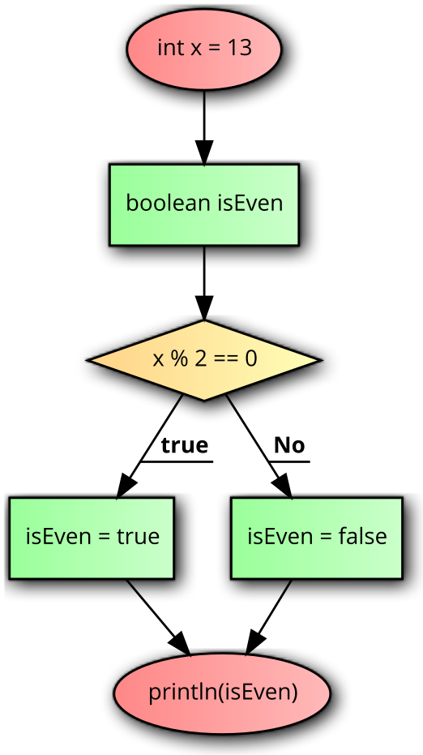
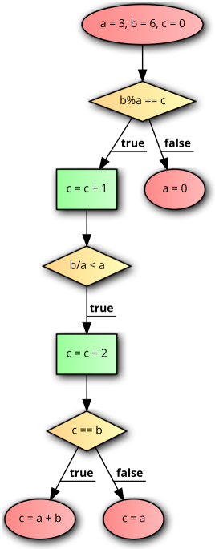

# Conditions

Conditions are based on *boolean expressions* and the program takes a specific course based on whether these expressions evaluate to `true` or `false`.

## An `if` condition
An `if` condition executes the conditional code only if the expression is evaluated to `true` and then the rest of the code. If the expression is evaluated to `false`, it executes the rest of the code directly.

```java
if(boolean expression) {
	conditional code
}
rest of the code
```

<center></center>

Example:

```java
int x = 10;
int result = 5;
if(x > 8) {
	result = result + 1;
}
print(result);
```

<center></center>


The above code executes the conditional code, increasing `result` by 1 and displaying the value 6.

## An `if-else` condition
An `if-else` condition executes the if-block if the expression is evaluated to `true` and the else-block if the expression is evaluated to `false`. The rest of code is executes after either case.

```java
if(boolean expression) {
	if-block statements
}
else {
	else-block statements
}
rest of the code
```

<center></center>

Example:

```java
int x = 13;
boolean isEven;
if(x % 2 == 0) {
  isEven = true;
}
else {
  isEven = false;
}
println(isEven);
```

<center></center>

The else-block is executed in the above code, `isEven` becomes `false`, and is displayed on the console.


## Exercises for conditions

### EXERCISE 1

Draw a flowchart for the following code and determine the values of `a, b, c` after the code executes.
 
```java
int a = 5, b = 2, c = 10;
if(a < b) {
	if(c == a) {
		c = c + 1;
	}
}
else {
	if(b < c) {
		b = c - a;
	}
	else {
		a = 0;
	}
}
```

### EXERCISE 2

Write a piece of code for the following flowchart and determine the values of `a, b, c` after the code executes.


<center></center>

## Coding to a truth table

A truth table is one that gives us the required output for some given inputs. For example, in the following table, for inputs `x` and `y`, the desired values for `exp` are provided.

| x     | y     | exp   |
|-------|-------|-------|
| false | false | false |
| false | true  | true  |
| true  | false | true  |
| true  | true  | false |

It can be seen that `exp` is `true` when,

- `x = true` and `y = false`, or,
- `x = false` and `y = true`

We can write this as,

```
exp = (x && !y) || (!x && y)
```

However, you can see that `exp` is `true` only when `x` and `y` hold different values. So we can also write a simpler expression as,

```
exp = (x!=y);
```

Consider the following scenario: we are given three boolean inputs `a, b, c`. We want an output value `d` based on the following truth table:

| a     | b     | c     | exp   |
|-------|-------|-------|-------|
| false | false | false | true  |
| false | false | true  | true  |
| false | true  | false | false |
| false | true  | true  | false |
| true  | false | false | false |
| true  | false | true  | false |
| true  | true  | false | false |
| true  | true  | true  | true  |

When is `exp = true`? In the following cases:

- `a = false, b = false, c = false`
- `a = false, b = false, c = true `
- `a = true, b = true, c = true `

The first and third conditions can be combined as

```
a == b && b == c
```

The second condition is

```
!a && !b && c
```

Thereby our overall expression is,

```
exp = (a==b &&b==c) || (!a && !b && c)
```

Of course, there are better ways to optimize expression building, but for our purpose, this is sufficient.

## Coding in the real world

When will the requirements be as clearly stated as a truth table? *Almost never!*

We need to code to vague/abstract/hazy requirements and in this section, we'll take a look as such scenarios.

## SCENARIO 1

There are students enrolled in degrees and can graduate if they are enrolled in a non-honors undergraduate course and have completed 72 credit points or more, or enrolled in an honors course and have completed 96 credit points or more, or if they are enrolled in a postgraduate program and have completed 48 credit points or more. Write a piece of code that determines if a specific student is eligible to graduate or not. You may assume that the following inputs are available:

1. Course in which student is enrolled: `String`. Can be either "UG"/ "UG (Hons)"/ "PG"
2. Number of credit points completed: `int`.

## SCENARIO 2

A website offers discounts based on item categories and quantities. There are four categories - A, B, C, and D. For all categories except D, the following rules exist,

- Less than 2 items: no discount
- Between 2 and 5 items: 15% discount
- Between 6 and 10 items: 25% discount
- More than 10 items: 30% discount


For category D, there is a 1% discount for every item purchased, up to a maximum of 50 items (and hence a maximum of 50% discount).


## SCENARIO 3

The shopping mall charges for parking based on the following rules:

- under 3 hours: free
- 3 hours to 3 hours 29 minutes: $4
- 3 hours 30 minutes to 3 hours 59 minutes: $7
- 4 hours to 4 hours 29 minutes: $11
- 4 hours 30 minutes to 4 hours 59 minutes: $16
- 5 hours to 5 hours 29 minutes: $22
- 5 hours 30 minutes to 5 hours 59 minutes: $30
- 6 hours or over: $40

Given the number of hours and minutes in two variables, write a piece of code that stores the parking cost in a variable `parkingFee`.

## SCENARIO 4

Write a piece of code to address the same problem as in scenario 3, but an additional rule. Weekend (Sat, Sun) parking incurs a flat rate of $4 per 30 minutes. That is,

- 0 to 29 minutes: $4
- 30 to 59 minutes: $8
- 60 to 89 minutes: $12
- and so on...

An additional variable `dayOfWeek` is available and is 0 for Monday, 1 for Tuesday and so on.


