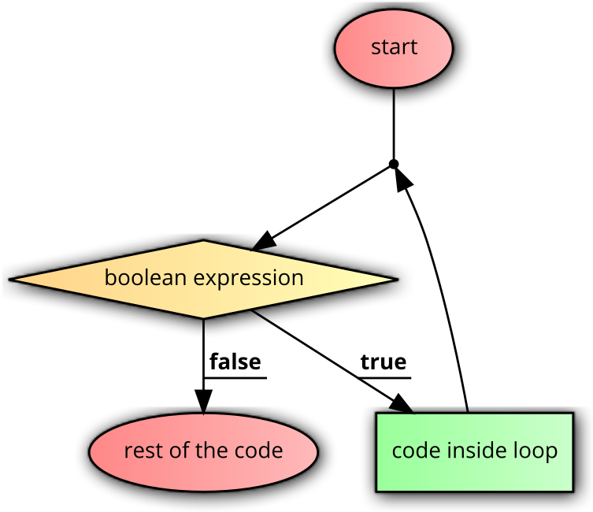
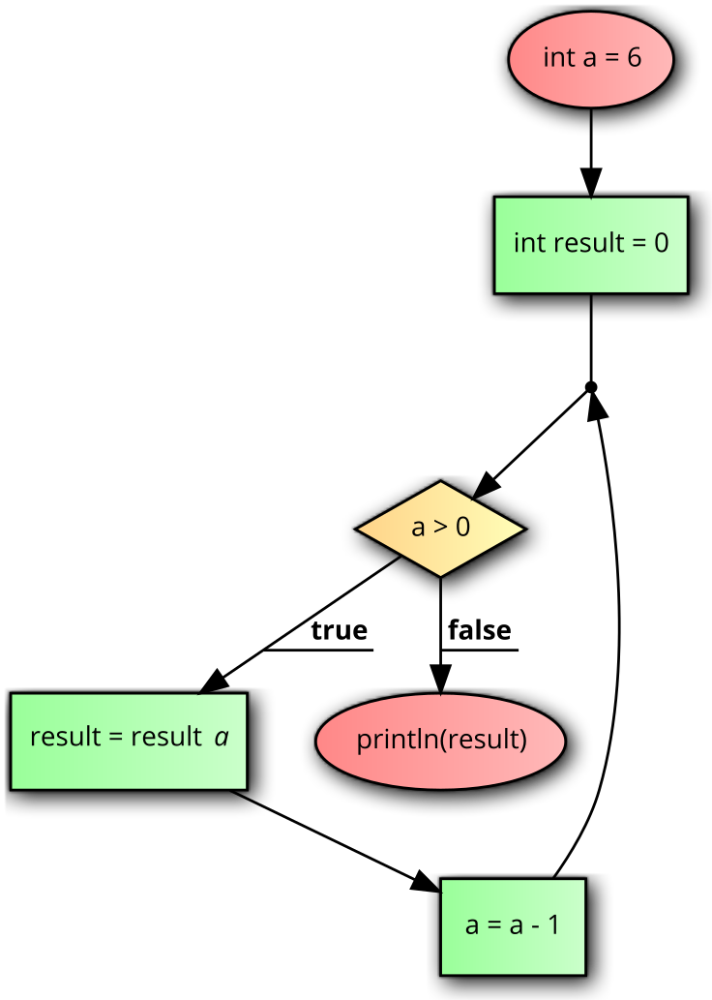
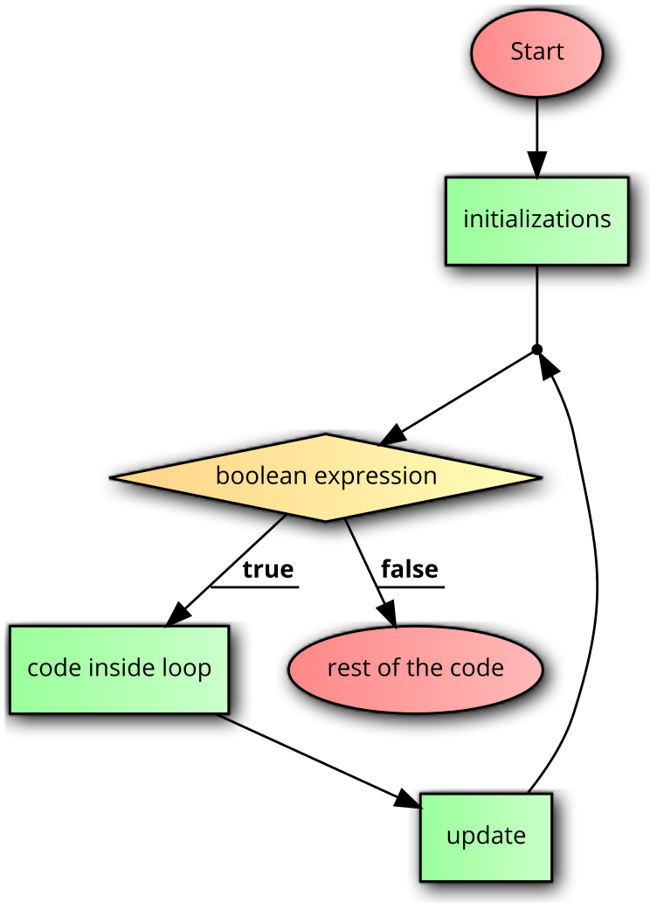

# Loops

Loops are similar to conditions except that after every iteration of the loop, the expression is checked again.

## A `while` loop


```java
while(boolean expression) {
	code inside loop
}
rest of the code
```

<center></center>

Example:

```java
int a = 6;
int result = 1;
while(a > 0) {
	result = result * a;
	a = a - 1;
}
println(result);
```

<center></center>


The above code executes the loop 6 times (for `a` = 6,5,4,3,2,1 but not for 0) each time multiplying the current value of `a` into `result` and the final value of `result` is 6\*5\*4\*3\*2\*1 = 720. 

There is a better way of tracing loops known as logic table construction. The logic table for the above example is given below.

| a 	| a > 0 	| result      	|
|---	|-------	|-------------	|
| 6 	| true  	| 1\*6 = 6     	|
| 5 	| true  	| 6\*5 = 30    	|
| 4 	| true  	| 30\*4 = 120  	|
| 3 	| true  	| 120\*3 = 360 	|
| 2 	| true  	| 360\*2 = 720 	|
| 1 	| true  	| 720\*1 = 720 	|
| 0 	| false 	|             	|

## Guidelines for constructing a logic table

While constructing a logic table, one is strongly encouraged to follow the following steps:

1. Identify all variables involved in the boolean expression in the loop header.
2. Create columns for each of the variables identified in step 1.
3. Create a column for the loop expression. Create multiple columns to simplify reaching the expression if complex. For example, if expression is `x==y && !z`, the variables involved are `x`, `y`, and `z` and the sub-expressions are `x==y` and `!z`.
4. Create columns for each variable (**unless column for the variable already present**) modified in the loop (in the order they are modified). Don't create columns v

### Example for constructing a logic table

```java
int a = 10, b = 2, c = 100;
int result = 0;
while(a > b || c > a) {
	result = result + 1;
	a = a - 1;
	c = c / 2;
}
```

| a  	| b 	| c   	| a > b 	| c > a 	| a > b && c > a 	| result  	|
|----	|---	|-----	|-------	|-------	|----------------	|---------	|
| 10 	| 2 	| 100 	| true  	| true  	| true           	| 0+1 = 1 	|
| 9  	|   	| 50  	| true  	| true  	| true           	| 1+1 = 2 	|
| 8  	|   	| 25  	| true  	| true  	| true           	| 2+1 = 3 	|
| 7  	|   	| 12  	| true  	| true  	| true           	| 3+1 = 4 	|
| 6  	|   	| 6   	| true  	| false 	| false          	|         	|

Note that we don't have columns for `a` and `c` again even though they are modified inside the loop because columns for those variables are already present in the table by virtue of step 2.

## for-loop

A for-loop is more compact than the while loop and *usually* more common in real-life applications.

```java
for(initializations; boolean expression; update(s)) {
  code inside loop;
}
rest of the code;
```

<center></center>

Example:

```java
int result = 0;
for(int i=1; i <= 16; i*=2) {
  result = result + i;
}
println(result);
```

Trace (logic table):

| i  	| i<=16 	| result     	|
|----	|-------	|------------	|
| 1  	| true  	| 0+1 = 1    	|
| 2  	| true  	| 1+2 = 3    	|
| 4  	| true  	| 3+4 = 7    	|
| 8  	| true  	| 7+8 = 15   	|
| 16 	| true  	| 15+16 = 31 	|
| 32 	| false 	|            	|

## Nesting of control structures

Control structures are literally like lego blocks, you can arrange them as you want, depending on the situation. So you can put loops/conditions inside other loops/conditions (and then more loops/conditions inside that and so on).

Let's take some examples of a situation where such nesting is required.

### Nesting scenario 1

We would like to generate a pattern based on input integer `N > 0`


`N=4`

```
^
^ ^
^ ^ ^
^ ^ ^ ^ 
```

<p>&nbsp;<p>

`N=6`

```
^
^ ^
^ ^ ^
^ ^ ^ ^ 
^ ^ ^ ^ ^ 
^ ^ ^ ^ ^ ^ 
```

**STEP 1:** There are `N` lines.

Outer loop - 

```java
for(int i=1; i<=N; i++) {
	display current line
	change line using println(); 
}
```

**STEP 2:** Line corresponding to a given value of `i` has `i` caps 

(when `i = 1`, there is 1 cap, when `i = 2` there are 2 caps, and so on ...).

Inner loop - 

```java
for(int k=1; k<=i; k++) {
	print("^");
}
```

**COMPLETE SOLUTION**

```java
for(int i=1; i<=N; i++) {
	for(int k=1; k<=i; k++) {
		print("^");
	}
	println(); 
}
```

### Nesting scenario 2

Change the code so that the symbols alternate between ^ and - between lines.

`N=6`

```
^
- -
^ ^ ^
- - - - 
^ ^ ^ ^ ^
- - - - - -
```

The difference from scenario 1 is that if counter is an odd number, it's a cap (`^`) while if the counter is an even number, it's a dash (`-`).

So the earlier display statement

```
print("^");
```

will change to,

```
if(i%2 == 1) { //odd counter: cap
	print("^");
}
else { //even counter: dash
	print("-");
}
```

**COMPLETE SOLUTION**

```java
for(int i=1; i<=N; i++) {
	for(int k=1; k<=i; k++) {
		if(i%2 == 1) { //odd counter: cap
			print("^");
		}
		else { //even counter: dash
			print("-");
		}
	}
	println(); 
}
```


### Nesting scenario 3 (Exercise)

Change the code so that the symbols alternate between ^ and - within a line.

`N=6`

```
^
^ -
^ - ^
^ - ^ -
^ - ^ - ^
^ - ^ - ^ -
```

### Nesting scenario 4 (Exercise)

Change the code so that the symbols alternate between ^ and - within a line and also the first symbol on each line is different from the first symbol on the previous line

`N=6`

```
^
- ^
^ - ^
- ^ - ^
^ - ^ - ^
- ^ - ^ - ^
```

## Coding in the real world

Just like in conditions, lets see some real-world scenarios where we need to use loops.

### SCENARIO 1

TODO

### SCENARIO 2

TODO

### SCENARIO 3

TODO

### SCENARIO 4

TODO


