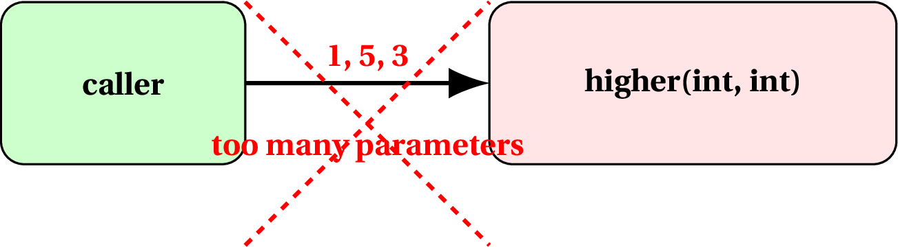
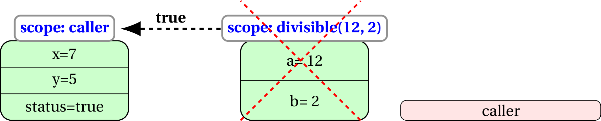

# Functions

A function is a named piece of code that can be supplied with some inputs (known as parameters) and may return a value back to the caller.

<center></center>

For example, we may have a function that determines the higher of two integers. We can call it by passing it two integers. If we pass the values 2 and 5, it should return 5.

<center></center>

However, if we pass only one value, it cannot be executed, as it expects two integers.

<center></center>

Similarly, you cannot pass it more than 2 values.

<center></center>

Even if you pass two values, you must ensure they are of the right type. For example, we cannot pass a `boolean` instead of an integer.

<center></center>

## Defining a function

Syntax of a function definition is:

```java
returnType function(<parameters>) {
    <some code>
    <return statement>
    <some code>
}
```

### Example

```java
boolean divisible(int a, int b) {
    if(a%b == 0)
        return true;
    else
        return false;
}
```

-   The function accepts two parameters, that it names `a` and `b`
    during the execution of the function. Here, `a, b` are called
    *formal parameters*.

-   The function returns a value of type `boolean` back to the caller.

-   Let’s say the call to function `divisible` is,

        int x = 7, y = 5;
        boolean status = divisible(x+y, x-y);

-   The integer expressions `x+y` and `x-y` are evaluated to 12 and 2
    respectively. The evaluated values are known as *actual parameters*
    and are copied into the formal parameters `a, b` during the
    execution of `divisible(12, 2)`.

-   Scope is transferred from the caller to the function call
    `divisible(12, 2)`.

<center></center>

-   The function determines that the boolean expression `a%b == 0` is
    `true`, executes the if-block and returns `true`.

-   The control is transferred back to the caller with the returned
    value `true` being copied into variable `status`.

<center></center>

## Exercises

### Exercise 1

Suppose we have a functiono that accepts a real number (`double`) and returns its square. 

Draw a block diagram for the interaction when a caller calls a function with the value 2.5. Assume the name of the formal parameter is `val`, and the value returned by the function is copied into a variable `sqr`.


### Exercise 2

Consider the following functiono definition,

```java
int roundOff(double a) {
	return (int)(a+0.5);
}
```

Write a statement in the caller that calls the function `roundOff` with the parameter 6.8 and stores the value returned in a variable `result`.


### Exercise 3

Define a function that when passed two integers, returns their average. Remember that 15/2 is 7 while 15/2.0 is 7.5.


### Exercise 4

Define a function that when passed an integer, returns the number of digits in the integer.


### Exercise 5 (advanced)

Define a function that when passed a 3-digit integer, returns the highest integer that can be constructed using the digits of the passed number. For example, if the function is called with parameter 182, it should return 821. If the function is called with 753, it should return 753.

# Coding in the real world

## SCENARIO 1

Given two integers (store in formal parameters `a, b`, define a function that determines if either of them is divisible by the other. Some input-output mappings are:

#### Mapping 1
`a = 14, b = 6` --> return `false`

#### Mapping 2
`a = 14, b = 7` --> return `true`

#### Mapping 3
`a = 9, b = 30` --> return `false`

#### Mapping 4
`a = 9, b = 36` --> return `true`

#### Mapping 5
`a = 12, b = 0` --> return `true` (0 is divisible by 12)

## SCENARIO 2

An year is leap if it satisfies one of the two conditions,

1. it's divisible by 400, or,
2. it's divisible by 4 but **NOT** by 100.

Define a function that determines if an year passed (store in formal parameter `year`) is `leap`. Return `true` if it's a leap year, and `false` otherwise. Some input-output mappings are:

#### Mapping 1
`year = 2016` --> return `true`

#### Mapping 2
`a = 1800` --> return `false`

#### Mapping 3
`a = 2018` --> return `false`

#### Mapping 3
`a = 1600` --> return `true`

## SCENARIO 3

I would like to count the number of non-trivial (apart from 1 and itself) divisors of a given integer. Some input-output mappings are:

#### Mapping 1
`n = 18` --> return `4` (as there are 4 non-trivial divisors: 2, 3, 6, 9)

#### Mapping 2
`n = 31` --> return `0` (as there is no non-trivial divisor of 31)

#### Mapping 3
`n = 77` --> return `2` (as there are 2 non-trivial divisors: 7, 11)


## SCENARIO 4

I would like to draw box using the symbol `^`. The specifics of the box (number of lines across which the box is displayed and the width) are passed as parameters. Some input-output mappings are:

#### Mapping 1
`nLines = 4, width = 8`

```
^^^^^^^^
^      ^
^      ^
^^^^^^^^
```

#### Mapping 2
`nLines = 7, width = 16`

```
^^^^^^^^^^^^^^^^
^              ^
^              ^
^              ^
^              ^
^              ^
^              ^
^^^^^^^^^^^^^^^^
```