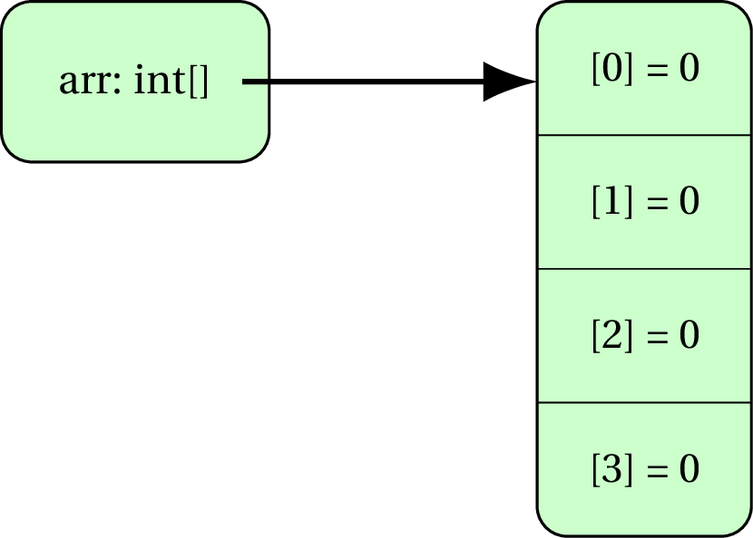
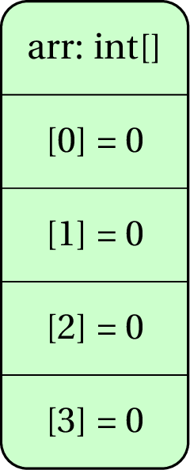
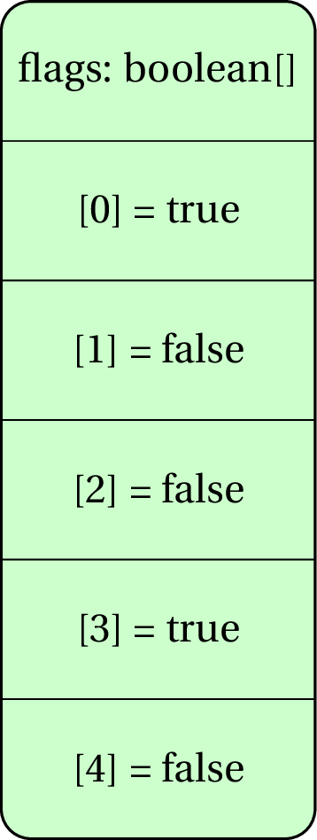
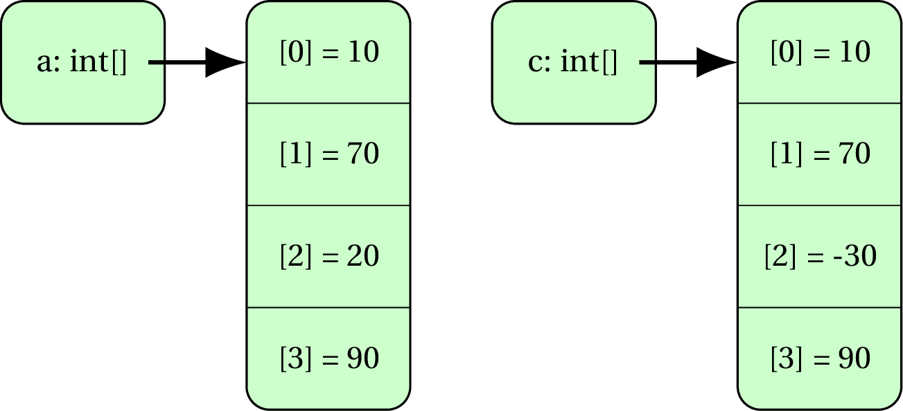
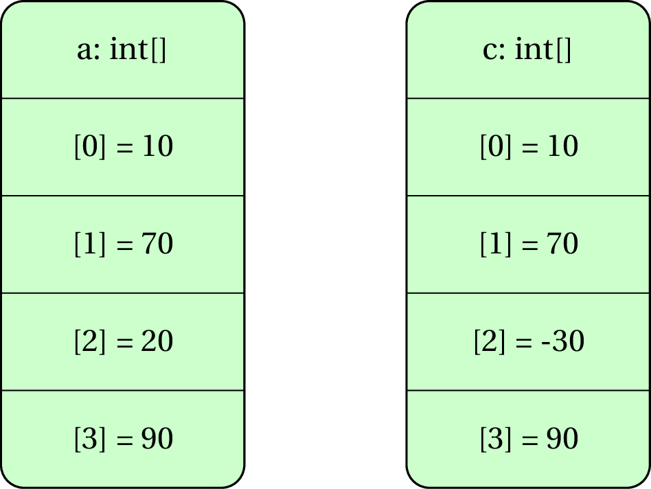

# Arrays

An array is a fixed-sized collection of items, each item of the same type.

So you can have,

- an array of 5 integers
- an array of 20 booleans
- an array of 2000 characters
- an array of 50 Strings
- and so on...


## Syntax to create an array

There are a few ways to create an array. 

### Creating array - Option 1

The most common way to create an array is by specifying the type and size of the array.

```java
type[] arrayName = new type[size];
```

#### Example

```java
int[] arr = new int[5]; //an array that holds 5 integers
```

```java
boolean[] flags = new boolean[8]; //an array that holds 8 booleans
```

### Creating array - Option 2

When you know the values that need to be stored in the array beforehand, you can create an array as,

```java
type[] arrayName = {item1, item2, ....};
```

#### Example

```java
int[] cutoffs = {50, 65, 75, 85};
```

```java
char[] punctuations = {'.', '!', '?', ',', ';', ':'};
```

The problem with this approach is that once an array is created, it cannot be re-referenced later (more about referencing soon).

### Creating array - Option 3

The third approach is similar to the second except you **can** update the reference later.

```java
type[] arrayName = new type[]{item1, item2, ....};
```

#### Example

```java
int[] cutoffs = new int[]{50, 65, 75, 85};
```

```java
char[] punctuations = new char[]{'.', '!', '?', ',', ';', ':'};
```


# Size of an array

The number of items in an array `arr` is given by `arr.length`.

For example,

```java
int[] data = new int[20];
println(data.length); //displays 20
```

# Accessing items of an array

- The first item of an array `arr` is at index 0.
- The second item of an array `arr` is at index 1.
- ...
- The last item of an array `arr` is at index `arr.length - 1`.

Thus you can traverse an array using a loop from `0` to `arr.length - 1` as,

```java
for(int i=0; i < arr.length; i++) {
	//do what you want with arr[i]
}
```

#### Example

Create an array that holds the outcome of 20 dice rolls.

Each dice roll is a random integer between 1 and 6.

```java
int[] outcomes = new int[20];
for(int i=0; i < outcomes.length; i++) {
	outcomes[i] = (int)random(1, 7); //remember 7 is not included
}
```

Then we can find out the average outcome as,

```java
int total  = 0;
for(int i=0; i < outcomes.length; i++) {
	total += outcomes[i];
}
double average = (total * 1.0)/outcomes.length; 
//multiplication with 1.0 to convert int to double
```


# Storage of an array and representation

For the next example, note that an integer takes up 4 bytes of memory.

The array items are held together in a block. 

Consider the following array,

```java
int[] arr = new int[4];
```

If the first item is at memory address 200-203, the second item will be at 204-207, the third item will be at 208-211 and the last item from 212-215.

The array itself holds the starting address, in this case 200.

We represent this as,

<center></center>

or a more simplified way of adding the array label above the items.

<center></center>

#### Example

```java
boolean[] flags = {true, false, false, true, false};
```

<center></center>


# Shallow copy

Copying an array (source) into another array (destination) using the `=` operator makes the destination refer to the same collection of items as the source.

#### Example

```java
int[] a = {10, 70, 20, 90};
int[] b = a;
b[2] = -30; //a[2] is also -30 now
```

The outcome is represented by the following memory diagrams,

<center></center>

or the more compact diagram,

<center></center>


# Deep copy

A *deep copy* is when you create an array of the same size as the source array and then copy each item one by one.

#### Example

```java
int[] a = {10, 70, 20, 90};
int[] c = new int[a.length];
for(int i=0; i < a.length; i++) {
	c[i] = a[i];
}
c[2] = -30; //a[2] won't change
```

The outcome is represented by the following memory diagrams,

<center></center>

or the more compact diagram,

<center></center>


#Exercises

## Exercise 1 

Draw the memory diagram for the following code,

```java
int[] data = new int[]{50, 90, 30, 20, 60};
```

## Exercise 2

Draw the memory diagram for the following code,

```java
int[] data = new int[6];
for(int i=0; i < data.length; i++) {
	if(i%2 == 0) {
		data[i] = 2*i+1;
	}
	else {
		data[i] = -3*i;
	}
}
```

## Exercise 3

Write a piece of code that creates the arrays represented in the following diagram.

<center></center>


## Exercise 4

Write a piece of code that creates an array with 100 integers, each between 1 and 20. Count the number of items that are divisible by the item after them.

For example, if the first few items of the array are `{20, 5, 8, 4, 4, ...}`, 20 is divisible by 5, 8 is divisible by 4, and 4 is divisible by 4, so we have 3 such items so far.

## Exercise 5

Consider the following piece of code.

```java
int[] items = new int[10];
items[0] = 1;
for(int i=1; i < items.length; i++) {
	items[i] = 2 * items[i-1];
}
```

What are the contents of the array `items`?


# Coding in the real life


## SCENARIO 1
The ages of 20 people is stored in an array `ageList`. Write a piece of code that determines the range of the distribution. That is, the age difference between the oldest and the youngest person.

## SCENARIO 2
The state of 25 electrical switches is held in an array `smartSwitches`. The states can be "On" (true) or "Off" (false). Write a piece of code that toggles all switches. That is, all switches that are currently "On" should turn "Off", and all switches that are currently "Off" should turn "On".

## SCENARIO 3
Assume that we are encoding birthdays as integers where 1st january is 1, 2nd january is 2, and so on till 31st january is 366 (remember that 29th february will also be given an integer mapping).

The birthdays of 1000 people is stored in an array `bdays`. Write a piece of code that displays the most frequent date of birth.

## SCENARIO 4
I keep track of the time taken (in minutes) to run each kilometer over a 100km race (let me dream!). These times are stored in an array `lapTimes`. For example, if `lapTimes[0]` is 6.23, it means I ran the first kilometer in 6 minutes 13.8 seconds. 

Write a piece of code that determines my fastest lap (for example, display "Kilometer 0-1" if the first kilometer was the fastest, and "Kilometer 63-64" if the 64th kilometer was the fastest.)

## SCENARIO 5

For the same scenario of the 100km run, find the fastest stretch of 10 kms (for example, display "Kilometer 13-23" if the stretch starting at 13 kilometers and ending at 23 kilometers was the fastest.)


## SCENARIO 6

For the same scenario of the 100km run, find the fastest stretch of `N` kms where `N` can be any value between 1 and 100 (inclusive on both sides).

<!--
better for arrays and functions
Create an array that holds the first 1000 prime numbers (a number is *prime* if it is more than or equal to 2 and is divisible by only 1 and itself).-->